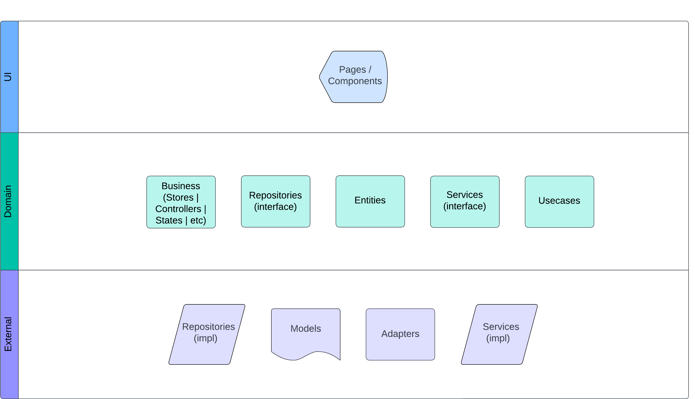
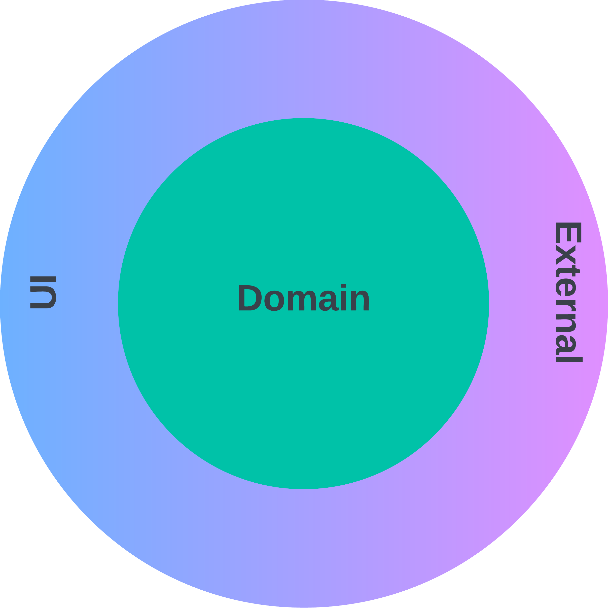

## Architecture

The applied architecture is a clean architecture that works with layers, where the external layers know the internal layers, but the internals don't know the externals.

The project is divided into the following layers:
* **UI**: Contains the user interface, components.
* **Domain**: Contains the business logic, entities, usecases, repositories and services (only interfaces).
* **External**: Contains the data access logic, repositories and services (implementations).

## Good Practices and Patterns

This project applies good programming practices and familiar patterns, such as SOLID principles, repository pattern, etc.